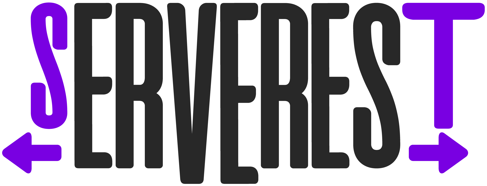

# Testes automatizados ServeRest (API e UI)

## ServeRest

> [API ServeRest](https://serverest.dev/)

> [UI ServeRest](https://front.serverest.dev/)

## Instalação e execução

### Pré-requisitos

- [git](https://git-scm.com/install/windows)
- [node 14+](https://www.nodejs.tech/pt-br/download)

### Clonar repositório

> git clone https://github.com/HelenDeunerFerreira/serverest_api_ui_automation.git

### Instalar dependências

> npm install

### Executar

> npx cypress open

## Testes API

### Produtos

- Cadastrar um novo produto
- Buscar informações de um produto pelo ID
- Atualizar informações de um produto
- Deletar um produto

### Usuários

- Criar um novo usuário
- Buscar informações de um usuário
- Atualizar informações de um usuário
- Deletar um usuário

## Testes UI

### Produtos

- Criar produto
- Validar que o produto criado está disponível

### Usuários

- Criar novo usuário
- Validar que o usuário criado está disponível
- Editar o usuário (funcionalidade não está funcionando no site, então a automação apenas clica no botão)
- Deletar usuário
- Validar que usuário deletado não está mais disponível
